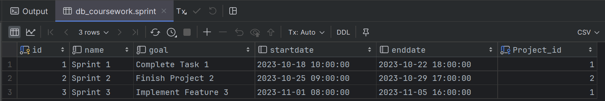
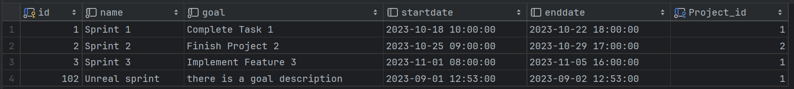
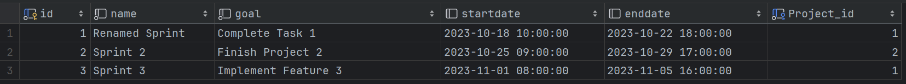

# Тестування працездатності системи

## Попереднє заповнення таблиці Sprint



## Тестування

### Отримати всі
**Запит:**

```http request
GET http://localhost:8080/sprints
```

**Відповідь:**

```json
{
  "_embedded": {
    "sprints": [
      {
        "name": "Sprint 1",
        "goal": "Complete Task 1",
        "startdate": "2023-10-18T07:00:00.000+00:00",
        "enddate": "2023-10-22T15:00:00.000+00:00",
        "projectID": 1,
        "_links": {
          "self": {
            "href": "http://localhost:8080/sprints/1"
          },
          "sprint": {
            "href": "http://localhost:8080/sprints/1"
          }
        }
      },
      {
        "name": "Sprint 2",
        "goal": "Finish Project 2",
        "startdate": "2023-10-25T06:00:00.000+00:00",
        "enddate": "2023-10-29T15:00:00.000+00:00",
        "projectID": 2,
        "_links": {
          "self": {
            "href": "http://localhost:8080/sprints/2"
          },
          "sprint": {
            "href": "http://localhost:8080/sprints/2"
          }
        }
      },
      {
        "name": "Sprint 3",
        "goal": "Implement Feature 3",
        "startdate": "2023-11-01T06:00:00.000+00:00",
        "enddate": "2023-11-05T14:00:00.000+00:00",
        "projectID": 1,
        "_links": {
          "self": {
            "href": "http://localhost:8080/sprints/3"
          },
          "sprint": {
            "href": "http://localhost:8080/sprints/3"
          }
        }
      }
    ]
  },
  "_links": {
    "self": {
      "href": "http://localhost:8080/sprints?page=0&size=20"
    },
    "profile": {
      "href": "http://localhost:8080/profile/sprints"
    }
  },
  "page": {
    "size": 20,
    "totalElements": 3,
    "totalPages": 1,
    "number": 0
  }
}
```

### Отримати за id

**Запит:**

```http request
GET http://localhost:8080/sprints/1
```

**Відповідь:**

```json
{
  "name": "Sprint 1",
  "goal": "Complete Task 1",
  "startdate": "2023-10-18T07:00:00.000+00:00",
  "enddate": "2023-10-22T15:00:00.000+00:00",
  "projectID": 1,
  "_links": {
    "self": {
      "href": "http://localhost:8080/sprints/1"
    },
    "sprint": {
      "href": "http://localhost:8080/sprints/1"
    }
  }
}
```

### Створити

**Запит:**

```http request
POST http://localhost:8080/sprints
Content-Type: application/json

{
  "name": "Unreal sprint",
  "goal": "there is a goal description",
  "startdate": "2023-09-01T09:53:00",
  "enddate": "2023-09-02T09:53:00",
  "projectID": 1
}
```

**Результат:**



### Змінити

**Запит:**

```http request
PATCH http://localhost:8080/sprints/1
Content-Type: application/json

{
  "name": "Renamed Sprint"
}
```

**Результат:**

Виконаємо запит з тесту під номером 2:

```json
{
  "name": "Renamed Sprint",
  "goal": "Complete Task 1",
  "startdate": "2023-10-18T07:00:00.000+00:00",
  "enddate": "2023-10-22T15:00:00.000+00:00",
  "projectID": 1,
  "_links": {
    "self": {
      "href": "http://localhost:8080/sprints/1"
    },
    "sprint": {
      "href": "http://localhost:8080/sprints/1"
    }
  }
}
```

### Видалити

**Запит:**

```http request
DELETE http://localhost:8080/sprints/102
```

**Результат:**



Sprint з id 102 було видалено